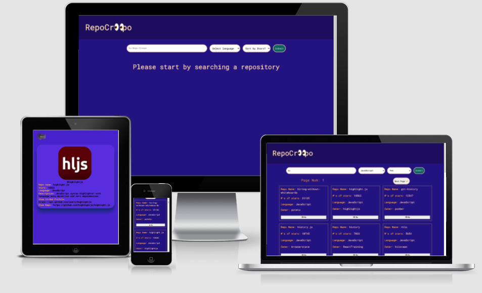
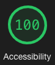
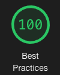
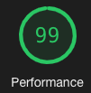

# RepoCreepo

### Table of Contents
- [RepoCreepo](#repocreepo)
    - [Table of Contents](#table-of-contents)
  - [Overview](#overview)
    - [GitHub Repo LINK](#github-repo-link)
    - [Deployed LINK](#deployed-link)
  - [Features](#features)
  - [Technologies Used](#technologies-used)
  - [Setup Instructions](#setup-instructions)
      - [To run the app](#to-run-the-app)
      - [To run the Cypress test](#to-run-the-cypress-test)
  - [Credits](#credits)
      - [Author](#author)

## Overview
<table>
  <td>
    
  </td>
  <td>
    
  </td>
  <td>
    
  </td>
  <td>
    
  </td>
</table>

App that allows users search for repository using the [Github repository search API](https://docs.github.com/en/rest/reference/search#search-repositories). Repository lists are sorted by GitHub's default sort key (best match). User are able to sort the list by #'s of stars and also filter by language.

### GitHub Repo [LINK](https://github.com/asiisii/Repo-Creepo)

### Deployed [LINK](https://reverent-payne-1adcf0.netlify.app/) 
  
## Features

Fully responsive application with accessibility score of 100 (tested via lighthouse). After searching a respository user will be able to see pagination buttons. If there are more repositories then user can click on `Next Page 👉` button to see more repositories. If they wish to go back to the previous page then user can click on `👈 Previous Page` button. User can also click on the `👁 Me` button to view more details about each repository. If user is in details page then they will have an option to click on the `Back` button to go back to the search page.

**[Back to top](#table-of-contents)**

## Technologies Used
- GitHub API
- Cypress
- React
- Redux
- Router
- JavaScript
- HTML
- CSS
- ESLint
- Netlify
- GitHub
- Miro
- React dev tools
- Redux dev tools
- Google dev tools

## Setup Instructions
1. Clone this [repository](https://github.com/asiisii/Repo-Creepo)
2. `cd` into the repository in your terminal
3. `npm i` to install required dependencies 

Then:-
#### To run the app
 -  `npm start` in your terminal to view it on your browser
 -  If browser doesn't open automatically, open the browser and navigate to `http://localhost:3000`
#### To run the Cypress test 
 -  `npm run Cypress` in your terminal to run the Cypress test
 -  Then click on `_spec.js` files to run each test
   

## Credits
#### Author
<table>
  <tr>
    <td> Ashish Malla <a href="https://github.com/asiisii">GH</td>
  </tr>
  <td>
    
  </td>  
</table>

**[Back to top](#table-of-contents)**
